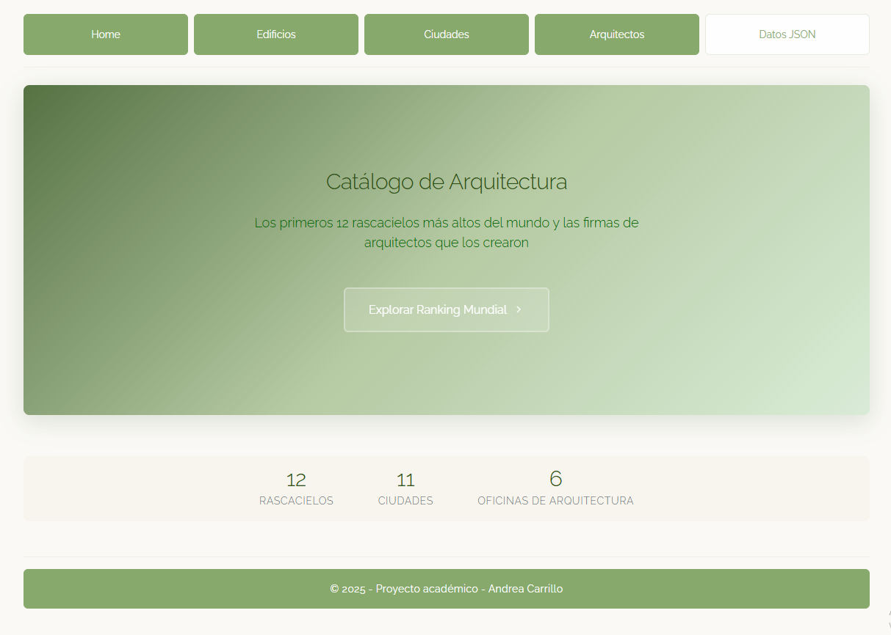

# 🏗️ Tallest Buildings Catalog

Aplicación web moderna construida con **Nuxt.js 3** que presenta un catálogo interactivo de los 12 rascacielos más altos del mundo, implementando navegación cruzada entre edificios, ciudades y firmas arquitectónicas.


## � Características

- **� Diseño Responsivo:** Optimizado para escritorio y móviles
- **🎨 Tema Ecológico:** Paleta de colores armoniosa con verdes y tonos naturales
- **🏢 Catálogo Completo:** 12 rascacielos, 11 ciudades, 6 firmas de arquitectura
- **🔍 Navegación Intuitiva:** Enlaces cruzados entre edificios, ciudades y arquitectos
- **� Datos Estructurados:** Información detallada en formato JSON
- **⚡ Renderizado Híbrido:** SSG/SSR con Nuxt.js 3

## �️ Arquitectura del Proyecto

```
proyecto-edificios/
├── components/global/       # Componentes globales
│   ├── HeaderView.vue      # Navegación principal
│   └── FooterView.vue      # Pie de página
├── content/                # Contenido en Markdown y JSON
│   ├── architects-md/      # Perfiles de arquitectos (6 firmas)
│   ├── cities-md/          # Información de ciudades (11 ciudades)
│   ├── buildings-md/       # Detalles de edificios (12 rascacielos)
│   └── buildings_json.json # Datos estructurados
├── pages/                  # Rutas de la aplicación
│   ├── index.vue          # Página principal minimalista
│   ├── architects-md/     # Páginas dinámicas de arquitectos
│   ├── cities-md/         # Páginas dinámicas de ciudades
│   ├── buildings-md/      # Páginas dinámicas de edificios
│   └── buildings_json/    # Listado y detalles JSON
├── public/                # Recursos estáticos
│   ├── images/           # Imágenes de edificios, ciudades y arquitectos
│   └── css/             # Estilos CSS personalizados
└── nuxt.config.ts        # Configuración de Nuxt.js
```

## 🚀 Instalación y Desarrollo

```bash
# Clonar e instalar
git clone https://github.com/AndCarrillo/tallest-buildings.git
cd tallest-buildings
npm install

# Desarrollo
npm run dev          # Servidor local
npm run build        # Build producción
npm run preview      # Vista previa
```

### Rutas Principales

- **`/`** - Landing page minimalista
- **`/buildings_json`** - Catálogo completo de edificios
- **`/cities-md/[slug]`** - Perfiles de ciudades con relaciones
- **`/architects-md/[slug]`** - Portafolios de firmas arquitectónicas

---

## Diseño y UX

- **Paleta Ecológica:** Forest Green, Sage Green, Stone Gray
- **Tipografía:** Raleway para legibilidad óptima
- **Layout:** Grid responsivo con Skeleton CSS
- **Navegación:** Enlaces cruzados inteligentes
- **Hero Section:** Banner principal con overlay de gradiente
- **Estadísticas:** Resumen visual en la página principal

---

## 🖼️ Vista Previa de la Aplicación



**Demo Live**: [Netlify Deploy](https://tallestbuildings.netlify.app/)

## 📄 Licencia

Proyecto académico - © 2025 Andrea Carrillo

---

⭐ **¡Dale una estrella si te gusta el proyecto!** ⭐
